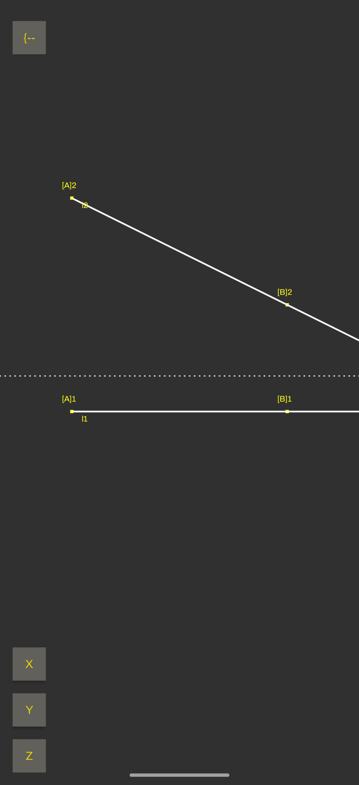
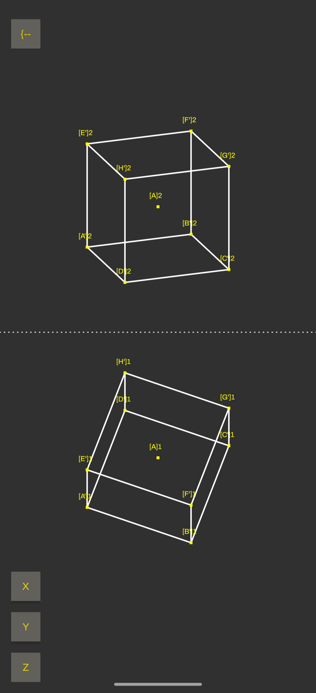

* Mobilní rozhraní mongeova promítání
** Funkcionality
- vykreslení bodů, přímek, úseček, krychlí, jehlanů
- možnost otáčení objektů po libovolné ose

** Obrázky

** Kompatibilita
- android

** Možná vylepšení
*** IDEA [#A] automatic graph rescaling
 - change how points are plotted
*** DONE [#B] UI
- second activity?
*** DONE [#A] 3D objects(cube etc.)
*** DONE [#A] 3D objects rotation
 - anchor point + angle
*** IDEA [#B] více objektů naráz
- výběr z nich
*** DONE [#B] posouvání objektů
*** IDEA [#B] uživatelská definice složitých těles
*** IDEA [#B] persistence
